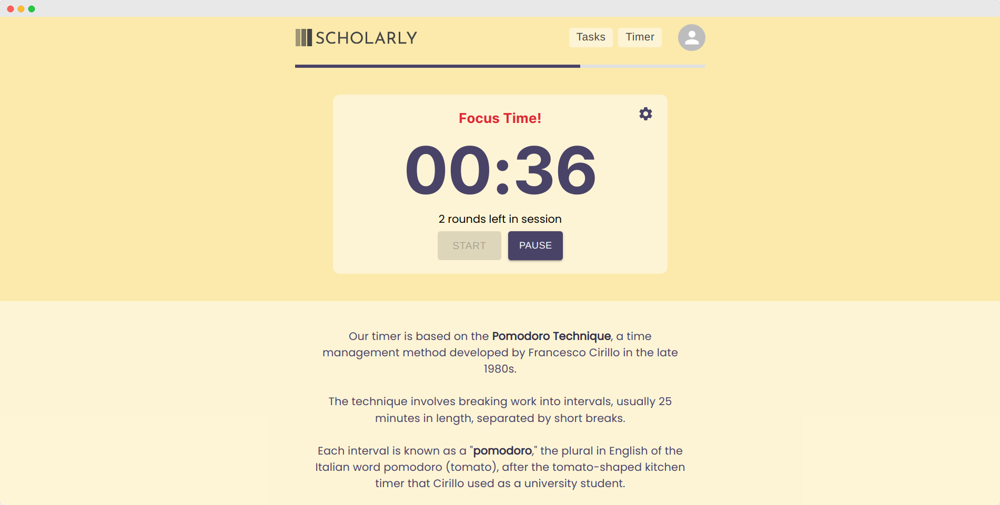

<h1 align="center">Academic Planner - Scholarly</h1>

  <a href="#tech-stack">Tech Stack</a> •
  <a href="#functionality">Functionality</a> •

  

  Scholarly is a web application designed to help students manage their academic schedule. It allows users to create and manage their tasks, assignments, and exams, as well as to maintain focused study sessions through a timer based on the Pomodoro Technique.

## Tech Stack

- [Next.js](https://nextjs.org/) - a React framework that enables server-side rendering and easy client-side routing.
- [React](https://reactjs.org/) - a JavaScript library for building user interfaces.
- [Material-UI](https://mui.com/) - a React UI framework that provides pre-built components and styling.
- [Express](https://expressjs.com/) - a lightweight web framework for Node.js that provides a simple API for building web applications.
- [Mongoose](https://mongoosejs.com/) - an Object Data Modeling (ODM) library for MongoDB that provides a higher-level API for interacting with the database.
- [bcrypt](https://www.npmjs.com/package/bcrypt) - a password-hashing function that provides secure storage of user passwords.
- [jsonwebtoken](https://jwt.io/) - a library for generating JSON Web Tokens (JWT) for user authentication.

## Functionality

- User Authentication
  - Users can create an account and log in to access their personalized academic schedule. Passwords are stored in a hashed format using the bcrypt library to ensure secure storage.
- Task Management
  - Users can create and manage their tasks, assignments, and exams. They can set due dates and times, descriptions, and categories for each task.
- Timer Page
  - Users can use a timer page to set a timer for a specified duration. The timer can be set for any amount of time, and it will count down until the time is up.
- Reminder System (In development)
  - Users can set reminders for important deadlines, such as assignment due dates or exam dates. Reminders can be set to notify the user via email or push notification.
- Calendar/Schedule Page (In development)
  - Users will be able to view their academic schedule on a visual calendar or schedule page.

